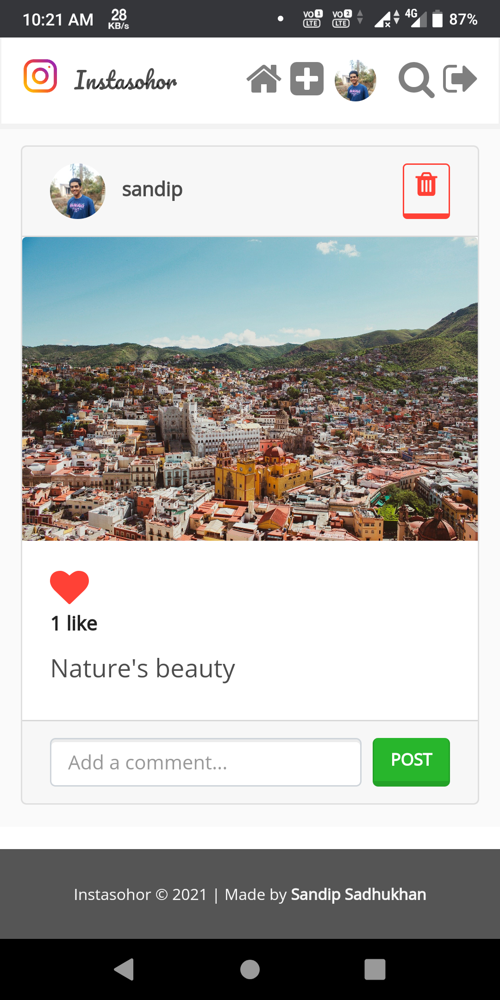

# Instasohor
Full Stack Instagram Clone with all the main functionalities.

Live Link - https://instasohor.pythonanywhere.com

## What can you do
You can create your profile, set your profile pic share pictures and follow others that will show you all the post shared by you and your followings's in your feed.

## Screenshots
Feed Page



Profile Page


## Technology Used
- HTML
- CSS
- Bootstrap
- Javascript
- Django
- Sqlite
- PythonAnywhere (for deploy)

## How to run locally
- Requirement: Python 3, Pip
```bash
# clone the repo
git clone https://github.com/sandippakhanna/instasohor.git

# install all dependencies
cd instasohor
pip install -r requirements.txt

# migrate the database
python manage.py migrate

# run the app
python manage.py runserver
```
Open http://localhost:8000 in your browser

## Developer
Sandip Sadhukhan

Mail - sandip.sendme@gmail.com
